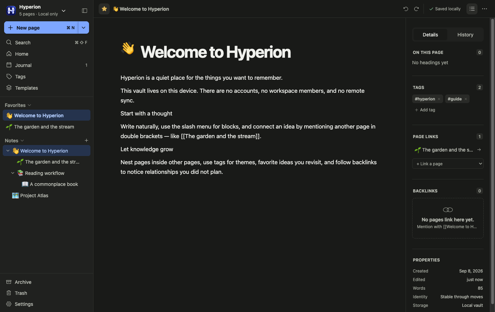

# Hyperion

Hyperion is a local-first personal knowledge base for ideas, notes, meeting
transcriptions, and more. It ships as an Electron desktop app with a React interface and a consistent
bundled Chromium runtime. SQLite stores all knowledge data locally.

## Download

 &nbsp; 

 &nbsp; 

## Current capabilities

- BlockSuite editor with rich text, slash commands,
  headings, lists, to-dos, callouts, code, LaTeX, tables, database views,
  kanban, images, attachments, bookmarks, and embeds
- Independent local vaults with switching, creation, deletion, JSON backup,
  and restore
- Automatic and named page versions with rich previews and restoration
- Verified database backups and complete portable vault exports, including assets and history
- A desktop SQLite database containing notes, rich editor documents, and assets,
  stored in `~/.config/hyperion` by default with a user-selectable location
- A resizable sidebar with a collapsible Notes tree where every page can
  contain child pages, with drag-and-drop nesting, persistent sibling order,
  and right-click actions for renaming, duplicating, favoriting, archiving,
  and removing pages
- AFFiNE-style page icons with the complete Unicode Emoji 17 catalog used by
  current macOS, searchable names and keywords, recent choices, categories,
  skin-tone variants, and a colored interface-icon picker; icons follow pages
  through the tree, links, search, and every other view without affecting identity
- Permanent page identities with rename-safe `[[Page name]]` references,
  quick page links, ID-based backlinks, and searchable former names
- Sortable/filterable table and card views, favorites, journal, search,
  recoverable archives, and trash
- Vault-scoped page templates with a searchable picker, direct template editing,
  and independently configurable defaults for new pages and journal entries
- Working vault, editor, appearance, and data settings
- Keyboard shortcuts for global search (`Command/Ctrl + Shift + F`), current-page
  search (`Command/Ctrl + F`), and new notes
- Responsive light and dark interfaces
- Platform repository and capability boundaries designed for future mobile and
  native local-AI voice integrations

## Development and builds

See the [brand and design guidelines](docs/brand.md) for the shared identity,
design tokens, and icon assets. A live brand guide is available from
**Settings → Appearance** in the app.

- `pnpm dev` starts desktop development.
- `pnpm dev:desktop` starts the Electron desktop target.
- `pnpm build:web` creates the desktop renderer assets.
- `pnpm build:desktop` creates native desktop packages.

See [development](docs/development.md), [building](docs/building.md), and
[architecture](docs/architecture.md) for requirements and details. Maintainers
can also review the [release process](docs/developer/release.md).

## Attributions

Thank you to the wonderful projects that make this project possible:

- [AFFiNE](https://affine.pro/) - the original inspiration of the project
- [BlockSuite](https://blocksuite.io/)
- [Phosphor Icons](https://phosphoricons.com/)
- [Emojibase](https://emojibase.dev/)
- [Yjs](https://yjs.dev/)
- [React](https://react.dev/)
- And many more!
