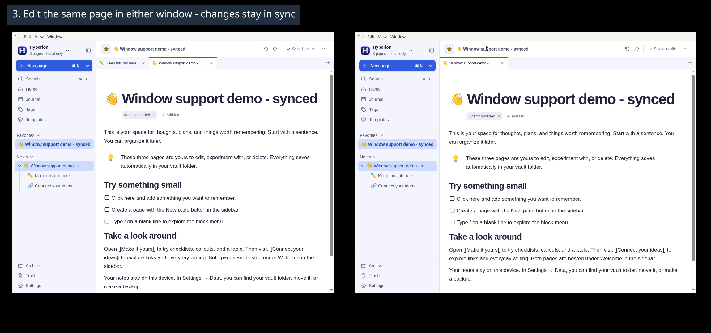

# Native tab detachment evidence

Recorded on this computer on 2026-10-07 against Hyperion commit `882f13ff33f7167bf9874fefa25dcc6252bd78e1`.

[Watch or download the 19-second MP4](window-support.mp4).

The recording shows a real X11 mouse drag moving a tab outside its Electron window, a second independent window opening, live edits appearing in both windows, and the detached window surviving the original window closing. It uses a temporary vault and profile on an Xvfb Linux desktop. The drag uses native XTest mouse events; the title edit uses the live editor's Yjs store. The video is captured from the desktop with ffmpeg, without a mocked renderer or window.

Validated with all 160 standard tests, lint, desktop type checking, the native window smoke suite, and the broader desktop smoke test. The native suite also covers cancellation, split panes, concurrent edits, independent reloads and vault selection, backups, failed destination startup, failed saves, and save-on-quit.

Video: H.264 MP4, 2300×1080, 24 fps, 18.54 seconds.

SHA-256: `cb27281b99d9fb2290ee3ec63359fbad5ca327dd3e68a7ced35002c8903d575c`
