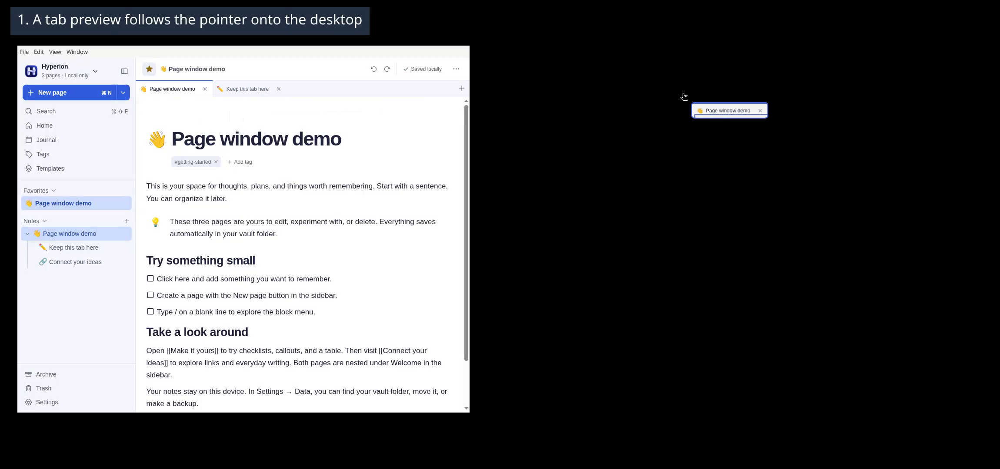
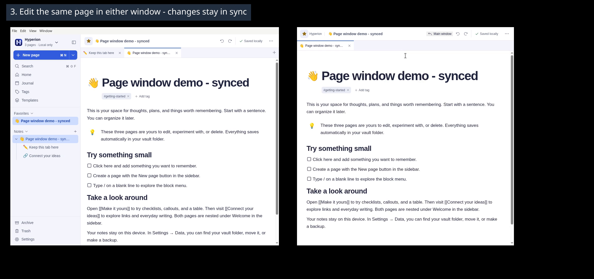

# Primary and page window evidence

Recorded remotely on this computer against Hyperion commit `f0cefd466a68b91e8b6f5d3ea858eab02402fbba`.

[Watch or download the 27-second revised flow](page-window-flow.mp4).

The video shows an actual X11 mouse drag with a visible native tab preview, a focused page window opening without a sidebar, live edits synchronizing with the primary, returning the page to the primary, and closing all page windows with the primary. It uses the real Electron app and built renderer with an isolated temporary vault and profile on an Xvfb Linux desktop. The drag uses native XTest mouse events; the title edit uses the live editor's Yjs store. ffmpeg captures the desktop directly.

Validation: all 161 standard tests, lint, desktop type checking, native window integration, and the broader desktop smoke test pass. The native suite covers preview visibility/cancellation/focus, split panes, narrow page windows, two-way concurrent edits, vault isolation and backups, failed transfer/save, return to primary, owned window closure, and save-on-quit. A regression test verifies that navigation history updates before the next input can arrive.

Video: H.264 MP4, 2300×1080, 24 fps, approximately 27 seconds.

SHA-256: `5693e255c337e238baf8cc46a814fa88d5028be345e617a8a26bf0309897441d`

The earlier independent-window recording is retained as `window-support.mp4` for history; the linked revised video demonstrates the current behavior.
