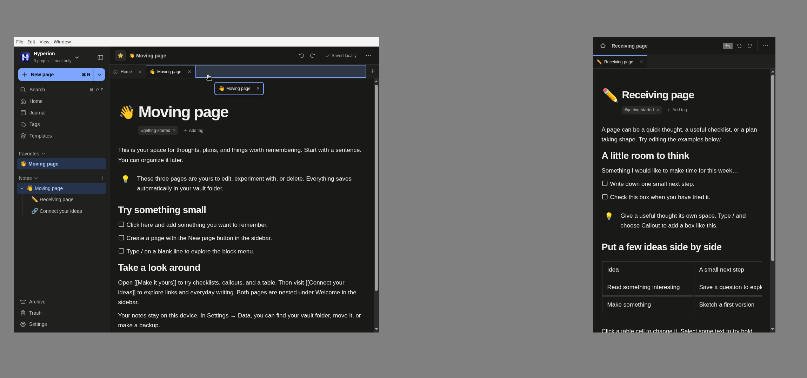
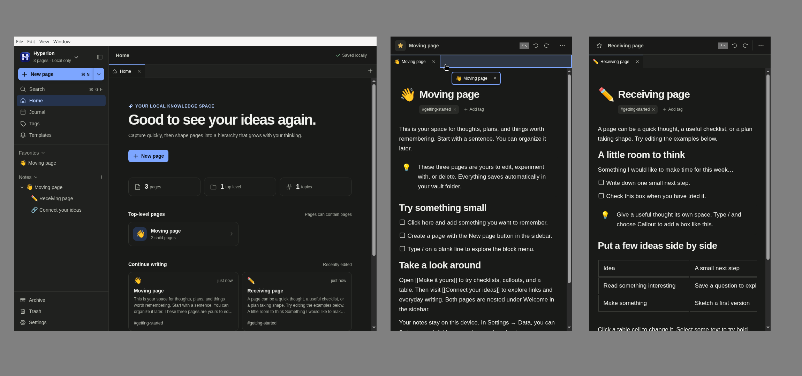

# Clean tab drag preview evidence

Recorded remotely on this computer against Hyperion commit `c6077bd764dc71d29c0594ace08c61066eaeeb4c` for [PR #51](https://github.com/alextac98/hyperion/pull/51).

[Watch or download the 28-second drag preview video](clean-tab-drag.mp4).

The recording shows a single clean tab preview while dragging over the originating page window and the primary window. It also shows transfers to another page window, back onto the primary tab strip, and from the primary into an existing page window. The destination receives the tab, an empty source page window closes, and a source with another tab stays open.

The preview renders its title and emoji/vector icon without capturing the live workspace. This keeps focus and drop outlines out of the preview. The Dockview DOM ghost is hidden once the native preview is ready, including its copied inline styles; the browser/failure fallback remains available.

Environment: the real Electron app and built renderer, a temporary vault and profile, and a 2300×1080 Xvfb Linux desktop with xcompmgr compositing for transparent native windows. Native XTest events drive the mouse drags. ffmpeg captures the desktop directly, with captions added for the video. No macOS compositor was available for direct testing.

Validation for this fix: renderer and Electron builds/type checks, lint, all 42 app tests, and the full native window integration suite pass. New native assertions cover suppression of the duplicate ghost, literal HTML-like titles, emoji and decoded vector icons, dark theme, correctly scaled previews at 125% zoom, and cleanup after cancellation. Existing native transfer, split-pane, concurrent-edit, reload, vault/backup isolation, failure, save and owned-window closure checks also pass.

Video: H.264 MP4, 2300×1080, 24 fps, 28.04 seconds. Fully decoded successfully.

SHA-256: `85d721495ef462f159326a325a8228d552a3f1edc317e2fbbd21ffe71e94e91e`

Earlier recordings are retained: [cross-window transfers](cross-window-tabs.mp4), [primary + page flow](page-window-flow.mp4), and [initial independent windows](window-support.mp4).
