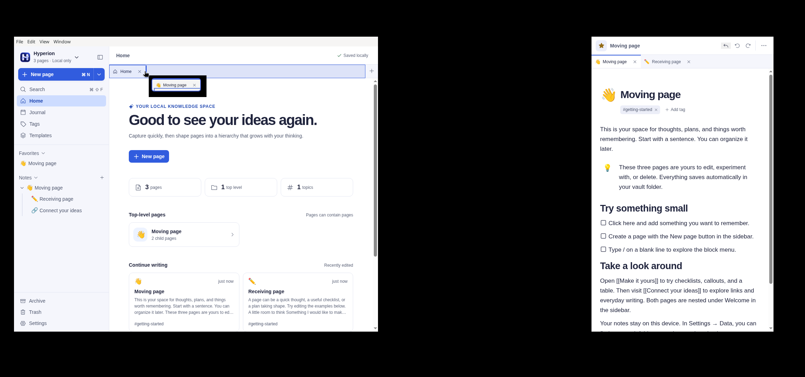
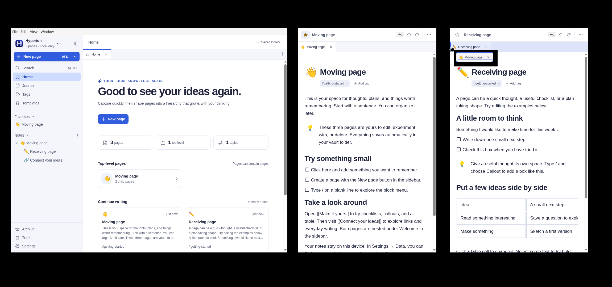

# Cross-window tab evidence

Recorded remotely on this computer against Hyperion commit `809a68cc6c14052d18fc7e530fbb3c32788c569a` for [PR #51](https://github.com/alextac98/hyperion/pull/51).

[Watch or download the 22-second cross-window tab video](cross-window-tabs.mp4).

The recording shows actual native mouse drags from a page window into another page window, back onto the primary tab strip, and from the primary into an existing page window. A visible tab preview follows the pointer; the destination highlights the tab strip and insertion position. The destination receives the tab, an empty source page window closes, and a source with another tab stays open.

Environment: the real Electron app and built renderer, an isolated temporary vault and profile, and a 2300×1080 Xvfb Linux desktop. Mouse drags use native XTest events. ffmpeg captures the desktop directly. The final edit uses the live editor's Yjs store. The video was decoded fully to verify the artifact.

Validation: all 161 standard tests, lint, desktop type checking, native window integration, and the broader desktop smoke suite pass. Cross-window integration covers chosen split panes, insertion order, transfers in both directions, reuse of already-open tabs, cancellation and preview/marker cleanup, 125% zoom, failed destination acknowledgements, and busy destinations preserving the source tab. Existing checks cover concurrent edits, vault/backup isolation, failed saves, returning to a hidden primary, primary-owned closure, and save-on-quit.

Video: H.264 MP4, 2300×1080, 24 fps, 21.54 seconds.

SHA-256: `92a7d26562472f6d318f375dd90acdebdf76161146bc157c884971671efdbc2e`

The [earlier primary + page flow](page-window-flow.mp4), recorded against commit `6c633b411b3d78fcdb47b21d8fb256f79f1bd6be`, shows detaching, live edits, the return button, and closing page windows with their primary. The initial independent-window recording is retained as `window-support.mp4` for history.
